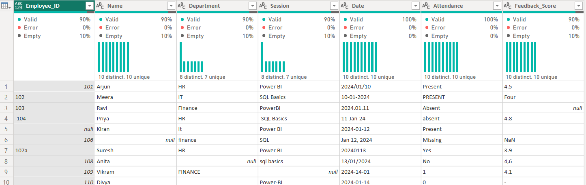
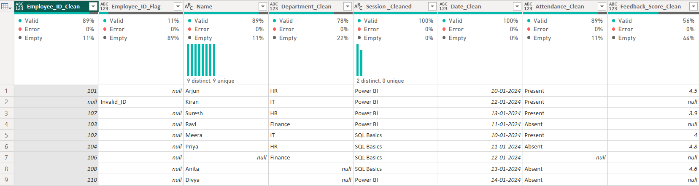

# Internal Team Training Analytics

This project demonstrates end-to-end **data cleaning and analytics** of internal team training attendance data using Power BI and Power Query.  
The dataset contained messy values such as inconsistent session names, invalid employee IDs, nulls, and duplicates.  
I applied systematic cleaning steps and built an interactive dashboard to extract meaningful insights.

---

## 🔹 Steps Followed

### 1. Data Import
- Imported raw dataset (`messy_training_attendance.xlsx`) into Power BI.
- Reviewed columns: Employee_ID, Name, Session, Date, Feedback.

### 2. Data Cleaning (Power Query)
- **Trimming & Standardization**
  - Applied `Text.Trim` to remove leading/trailing spaces.
  - Converted text to lowercase for consistency.

- **Session Normalization**
  - Created a **Mapping Table** with RawValue → CleanValue.
  - Replaced inconsistent entries (e.g., *powerbi, power-bi → Power BI*).
  - Ensured final column had standardized session names.

- **Employee_ID Validation**
  - Extracted numeric part from IDs using `Text.Select`.
  - Converted valid IDs into numbers with `try … otherwise null`.
  - Created a **Flag column** (`Valid` / `Invalid`) for data quality checks.

- **Duplicate Handling**
  - Checked duplicates across Employee_ID + Session + Date.
  - Marked records with duplicate counts for review.

- **Null Handling**
  - Identified missing values in critical fields (Employee_ID, Session, Date).
  - Replaced or removed based on context.

-**Refer to below images:**
-
-

### 3. Data Quality Reporting
- Added summary metrics:
  - % Valid Employee_IDs
  - % Invalid Employee_IDs
  - % Duplicate Records
  - % Unmapped Session Names

### 4. Dashboard Creation (Power BI Desktop)
-  **Session Analysis**: Training participation by session type.  
-  **Trend Analysis**: Employees trained per month.  
-  **Data Quality KPIs**: Valid vs Invalid IDs, duplicate percentages.  
-  **Employee View**: Employee-wise training participation history.  

### 5. Export & Documentation
- Exported cleaned dataset (`cleaned_training_attendance.csv`).
- Added screenshots of dashboard and cleaning steps.

---

## 🔹 Project Structure
Internal_Team_Training_Analytics/
│
├── data/
│ ├── messy_training_attendance.xlsx # raw dataset
│ └── cleaned_training_attendance.csv # cleaned dataset
│
├── pbix/
│ └── Internal_Team_Training.pbix # Power BI file
│
├── screenshots/
│ ├── dashboard_overview.png
│ └── data_cleaning_steps.png
│
└── README.md

## 🔹 Tech Stack
- **Power BI**: Power Query (M language), DAX, Data Modeling
- **Excel**: Raw data input
- **SQL**: Basic validation queries

---

## 🔹 Key Learnings
- Handling messy real-world data with Power Query
- Using mapping tables for scalable text cleaning
- Validating and flagging IDs for data quality
- Designing clean dashboards with data storytelling

---

